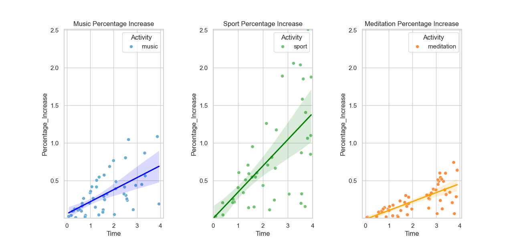
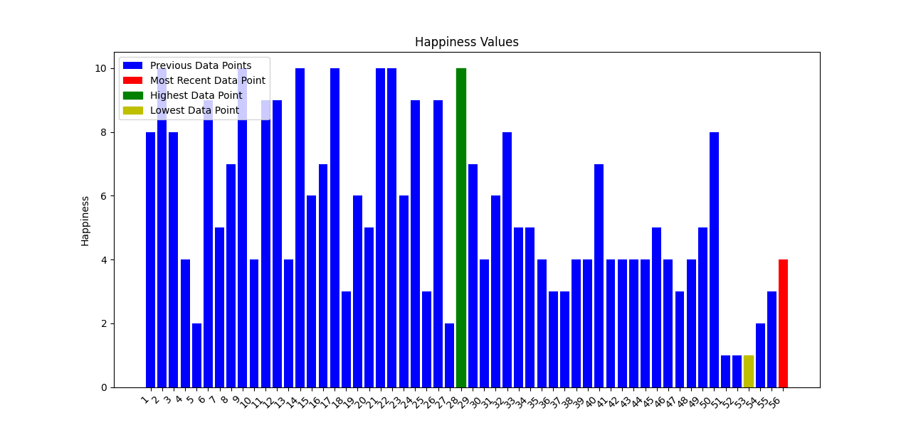
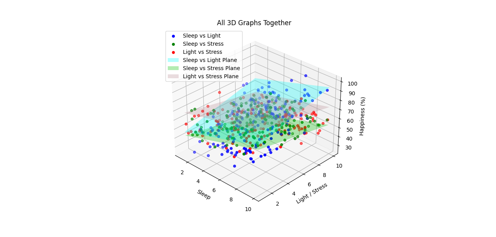

 # Leaving Certificate Computer Science Project 2024  
### **"Factors That Affect Happiness"**  
[]()
[]()
[]()
[]()
[]()
[]()
[]()
[](https://github.com/wiseMonke  )

**Exam Number: 146792** | **Grade: H1**



This project investigates how three key biometric factors—**sleep quality**, **ambient light exposure**, and **stress levels**—influence self-reported **happiness**. Built as a **fully automated embedded system** using a **Raspberry Pi** and **camera module**, it combines validated user input with facial analysis to estimate and visualise emotional well-being.

---

## 🎯 Project Overview

- **Core Idea**: A low-cost (**$40**), open-source happiness tracker using simulated biometric data and live facial detection.
- **Hardware**: Raspberry Pi + Camera Module (no external sensors—relies on user-reported inputs on a 1–10 scale).
- **Software**: Python CLI with data simulation, regression modelling, and OpenCV face detection.
- **Output**: Interactive command-line interface with rich **2D/3D visualisations** (bar charts, scatter plots, regression surfaces).

> 💡 *Due to Raspberry Pi hardware constraints, physical sensors were not used. Instead, user inputs are rigorously validated and combined with facial presence detection to proxy emotional state.*


- **Output**: Rich **2D/3D visualisations** (bar charts, scatter plots, regression surfaces) powered by `matplotlib` and `seaborn`.

> 💡 *This is not a deep learning emotion classifier. Instead, it uses **facial presence detection** (via OpenCV Haar cascades) as a binary proxy for engagement, combined with **user-reported biometrics** to model happiness—a pragmatic, resource-aware approach for embedded systems.*

---

## 🔬 Technical Highlights

### 🧪 Synthetic Data Generation (`generate.py`)
- Collected **real survey data** from 30 peers via Microsoft Forms.
- Used **statistical interpolation** with **normal distribution sampling** (`numpy.random.normal`) to expand the dataset to **170 synthetic records**.
- Preserved realistic correlations between factors while ensuring sufficient data volume for **regression analysis** and **"What-If" scenario testing**.
- Output saved as `simulated.csv`—used exclusively for **Advanced Requirements (AR1 & AR2)**.

### 📷 Embedded Vision with OpenCV (`picture.py`)
- Captures live image via Raspberry Pi Camera using `cv2.VideoCapture`.
- Applies **Haar Cascade Classifier** (`haarcascade_frontalface_default.xml`) to detect facial region of interest (ROI).
- **No emotion recognition**—only confirms **face presence**, acting as a lightweight analogue input.
- Designed to run **without GPU acceleration**, respecting Pi’s CPU and memory limits.

### 🖥️ Raspberry Pi as an Embedded System
- Runs **Raspberry Pi OS (64-bit)** with Python 3.9.
- Entire pipeline is **self-contained**: no internet, cloud, or external APIs.
- User interacts via **keyboard (digital I/O)** and **camera (analogue I/O)**—fulfilling **BR1**.
- Al
---l data stored **locally in CSV**—ensuring privacy and offline operation (**BR2**).

### 📈 Lightweight "ML" Approach
- While not using neural networks, the project applies **linear regression** (`sklearn.LinearRegression`) to:
  - Quantify correlations between each factor and happiness.
  - Answer **"What-If" questions** (e.g., *“Which factor most strongly predicts happiness?”*).
- **3D surface plots** visualise multi-factor interactions—demonstrating understanding of **multivariate analysis** without requiring advanced linear algebra.

---

## 📁 Repository Structure

```bash
.
├── Artefacts/ # Python source code & datasets
│ ├── main.py # CLI orchestrator with menu system
│ ├── generate.py # Simulates 170-point dataset using normal distribution
│ ├── picture.py # Captures image & detects face via OpenCV
│ ├── graph.py # 2D bar charts for biometric history
│ ├── regression.py # Linear regression for "What-If" questions
│ ├── 3dGraphs.py # 3D visualisations of factor interactions
│ ├── *.csv # Real + simulated biometric data
│ └── requirements.txt # Python dependencies
│
├── Report/ # Final HTML report (as submitted for LC)
│ ├── *.html # Investigation, Plan, Create, Evaluation, etc.
│ ├── styles.css # Custom styling
│ ├── script.js # Image expand functionality
│ └── assets/ # Diagrams, charts, write-ups, and screenshots
│
├── README.md
└── requirements.txt
```

---

> 🚫 The large demo video (`NewProjectVideo.mp4`, 171 MB) is **excluded** from this repo to comply with GitHub’s 100 MB file limit.

---

## 🧪 Key Features & Requirements Met

### ✅ **Basic Requirements (BR)**
- **BR1**: Fully automated embedded system (Raspberry Pi) using digital (keyboard) and analogue (camera) I/O.
- **BR2**: Validates 3 user inputs (1–10 integers) and stores them securely in a local `.csv`.
- **BR3**: Displays biometric history via multiple graphical formats (bar charts, scatter plots).

### ✅ **Advanced Requirements (AR)**
- **AR1**: Generated a synthetic dataset (`simulated.csv`) from real survey data using statistical interpolation.
- **AR2**: Answered two “What-If” questions using **3 validated parameters** and **2 data types** (primitive + Pandas DataFrame).
- **AR3**: Implemented regression models and 3D visualisations to reveal correlations between factors and happiness.

---

## 🛠️ Technologies Used

- **Languages**: Python, HTML/CSS/JavaScript
- **Libraries**:  
  `numpy`, `pandas`, `matplotlib`, `seaborn`, `scikit-learn`, `opencv-python`
- **Tools**: Raspberry Pi OS, Microsoft Forms (survey), Bootstrap 4 (report styling)

---

## 📊 Sample Visualisations

| 2D Bar Charts | 3D Regression Models |
|---------------|----------------------|
|  |  |

*(More in `Report/assets/`)*

---

## 🔒 Privacy & Limitations

- **Data stored locally** on the Raspberry Pi (no cloud transmission).
- **Not portable**: Requires monitor, keyboard, and continuous power.
- **Accuracy**: Happiness is subjective; system provides a *proxy estimate* based on user input + facial cues.

---

## 🌟 Future Improvements

- Web-based GUI (instead of CLI)
- Support for pre-recorded images/videos
- Bluetooth data sharing
- End-to-end encryption for biometric data

---

## 📜 License

This project was submitted for the **Irish Leaving Certificate Computer Science** examination (2024).  
All code and documentation are **open for educational use**.

> © Exam Number: 146792  
> *Archived Leaving Certificate Computer Science Project (2024) — Grade: H1*

[](https://github.com/wiseMonke)
